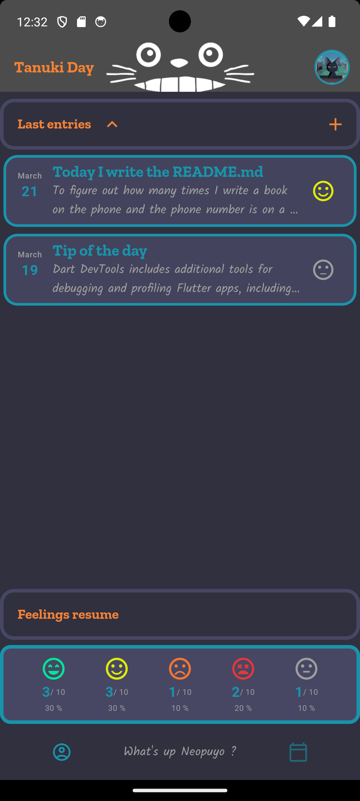
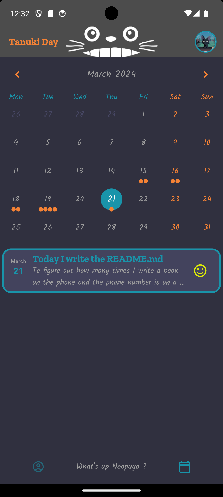
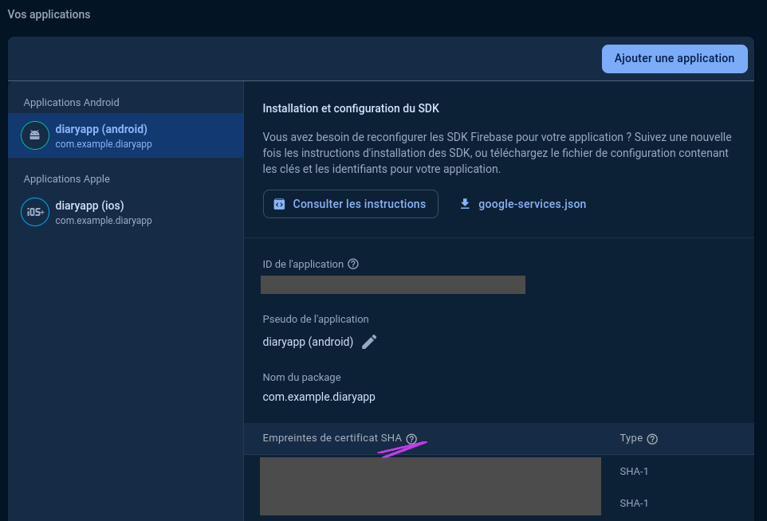
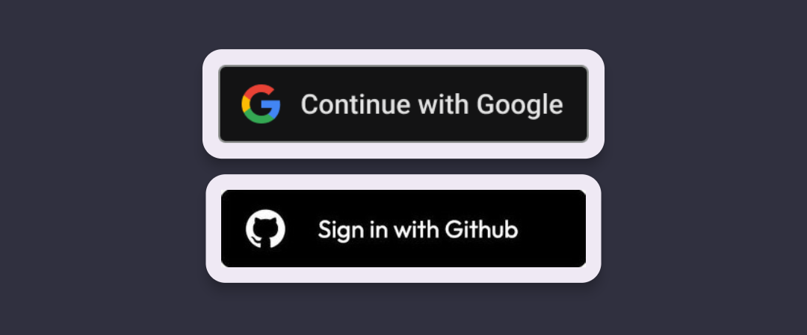
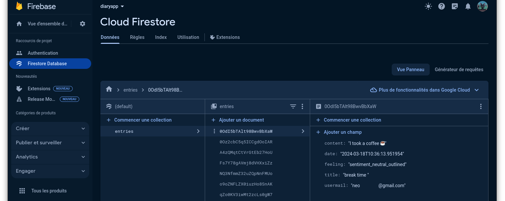
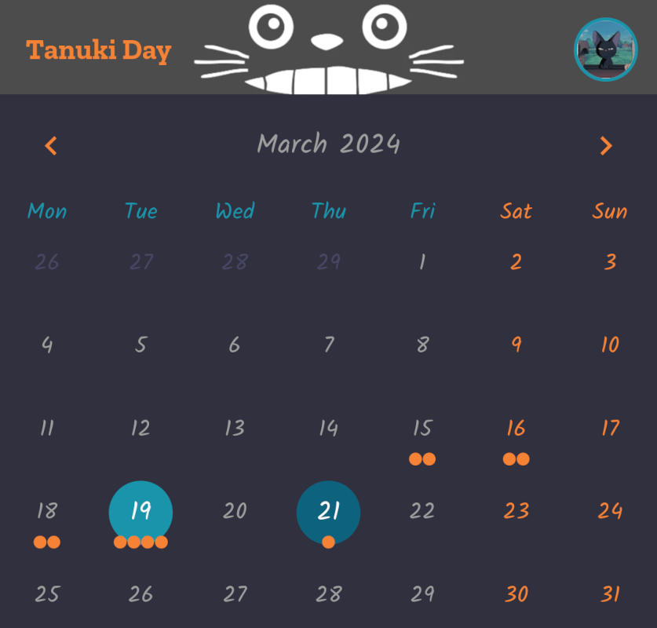
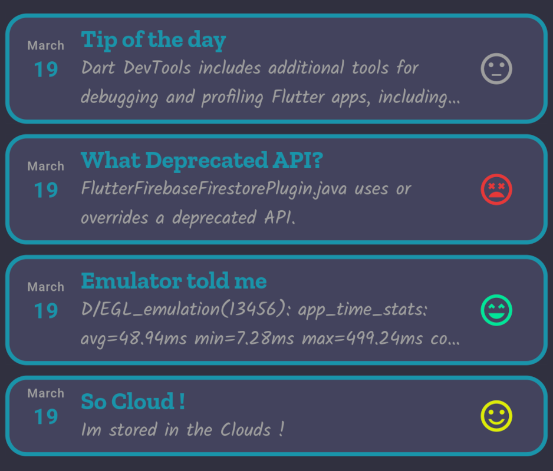

# TanukiDay


*A Flutter project focused on **authenticate**, **database**, **manage and display data**.*

> Cloud solution : **Firebase**  
> - **Authentication** using `OAuth`  
> - **Firestore database** using `NoSQL` 

---

| Login page | Profil page | Calendar page |
| --- | --- | --- |
|  |  |  |

## Table of Contents

**OAuth and login**  
\- [Firebase](#firebase)  
\- [Authentication](#authentication)  
&emsp; \- [Google sign in](#google-sign-in)  
&emsp; \- [Github sign in](#github-sign-in)  
\- [Router](#router)  
**Database**  
\- [Database in Firebase](#database-in-firebase)  
&emsp; \- [Realtime Database](#realtime-database)  
&emsp; \- [Firestore Database](#firestore-database)  
\- [Build a Calendar based on firestore data](#build-a-calendar-based-on-firestore-data)  
**Fixes**  
\- [Kotlin, Gradle, emulator fixes](#kotlin---gradle---emulator-fixes)  

## Firebase

<span style="font-size: 8px;">[Go back to table of content](#table-of-contents)</span>

> Firebase is a Backend-as-a-Service (BaaS) app development platform that provides hosted backend services such as a realtime database, **cloud storage**, **authentication**, crash reporting, machine learning, remote configuration, and hosting for your static files.  
\- [*Flutter doc*](https://docs.flutter.dev/data-and-backend/firebase) -


**DOCUMENTATION**    
\- [Add Firebase to your Flutter app](https://firebase.google.com/docs/flutter/setup?platform=ios)  
&emsp; Get started tutorial  
\- [Get to know Firebase for Flutter](https://firebase.google.com/codelabs/firebase-get-to-know-flutter#0)  
&emsp;  Complete tutorial, going beyond current needs but nice to keep it for the router 

**MAIN STEPS**

**1.** [Install](https://firebase.google.com/docs/cli#setup_update_cli) `Firebase CLI` then use a google/gmail account to log in.

```zsh
firebase login
```

**2.** install the [FlutterFire CLI](https://firebase.google.com/docs/cli#setup_update_cli)  **globally**, then add it to your PATH environnement variable.

```bash
dart pub global activate flutterfire_cli
```
**3.** In **Flutter project folder** :

Use this command each time after updating app structure or pluggin settings in firebase. This will generate *lib/firebase_options.dart*, *android/app/google-services.json* and *ios/Flutter/Runner/GoogleService-Info.plist* setting files.

```zsh
flutterfire configure 
```

**4.** Add [firebase_core package](https://pub.dev/packages/firebase_core)  
```zsh
flutter pub add firebase_core
```
 
In *lib/main.dart*, import the Firebase core plugin and the configuration file you generated earlier. Also, initialize Firebase using the DefaultFirebaseOptions object exported by the configuration file.

```dart
    import 'package:firebase_core/firebase_core.dart';
    import 'firebase_options.dart';

    await Firebase.initializeApp(
      options: DefaultFirebaseOptions.currentPlatform,
    );
```


## Authentication

<span style="font-size: 8px;">[Go back to table of content](#table-of-contents)</span>


### Google sign in

Official tutorial to start up [Get Started with Firebase Authentication on Flutter](https://firebase.google.com/docs/auth/flutter/start)

Then read and follow this package [google_sign_in dart package](https://pub.dev/packages/google_sign_in/example)  

To get the **SHA1 key** needed by firebase in authenticate settings, use in a terminal window *in android project folder* : 

```bash
./gradlew signingReport
```



Here the code i used :  
```dart
import 'package:firebase_auth/firebase_auth.dart';
import 'package:google_sign_in/google_sign_in.dart';
import 'dart:developer' as dev;

static Future<bool> signInWithGoogle() async {
    try {
      final GoogleSignInAccount? googleUser = await GoogleSignIn().signIn();

      final GoogleSignInAuthentication? googleAuth =
          await googleUser?.authentication;

      final credential = GoogleAuthProvider.credential(
        accessToken: googleAuth?.accessToken,
        idToken: googleAuth?.idToken,
      );
      await FirebaseAuth.instance.signInWithCredential(credential);
      return true;
    } on Exception catch (e) {
      dev.log('exception->$e');
      return false;
    }
  }
```

### Github sign in

<span style="font-size: 8px;">[Go back to table of content](#table-of-contents)</span>

> *"Not as straightforward as Google sign in"*

**Preliminary Remarks**

A first attempt, following this 
[medium  article of 2020](https://medium.com/flutter-community/flutter-firebase-github-authentication-990fe8731d9e) wich use `url_launcher` and `uni_links`. This [article](https://medium.com/firebase-developers/dive-into-firebase-auth-on-flutter-third-party-authentication-a242472ae347) was usefull too.  

The second attempt, following this [geek for geeks article of 2023](https://www.geeksforgeeks.org/flutter-firebase-github-authentication/) based on [github_sign_in_plus](https://pub.dev/packages/github_sign_in_plus) package.

> While implementing **Github sign in**, I encountered various issues related to **Gradle** **settings**, **Kotlin version**, and the **Android emulator**. In this [section](#kotlin---gradle---emulator-fixes), I have compiled all the fixes that I found to address these problems.

**The Oauth Github App**

[Creating an **OAuth app**](https://docs.github.com/en/apps/oauth-apps/building-oauth-apps/creating-an-oauth-app) on **Github account** to fill the project URL field, i used the project github repository.  

Firebase give the **redirect URL** asked by Github :  
```
/* FIREBASE AUTH HANDLER */ 
https://<projectID>.firebaseapp.com/__/auth/handler
```

Then Github give us back  the **Client ID** and generate a **secret key**  

**Store sensitive data**

To comply with security and best practices, the **clientID** and **the secret key** should be kept secret in a .env file and not published in commits. I followed this [article](https://dev.to/namankk/securely-storing-api-keys-in-flutter-3ko4) that shows how to access environment variables from the .env file in a Flutter project. This involved using the following three packages to generate the env.g.dart file.  

```yaml
dependencies:
  envied: ^0.5.3
  envied_generator: ^0.5.3

dev_dependencies:
  build_runner: ^2.4.8
```

> **FixTip** : *"Envied requires types to be explicitly declared"*  
> use **String** instead of **const** in package or article sample code  

```dart
import 'package:envied/envied.dart';
part 'env.g.dart'; // the generated file

@Envied(path: '.env')
abstract class Env{
  @EnviedField(varName: 'GITHUB_AUTH_URL',obfuscate: true)
  static String githubAuthUrl=_Env.githubAuthUrl;

  @EnviedField(varName: 'GITHUB_CLIENT_ID',obfuscate: true)
  static String githubClientId=_Env.githubClientId;

  @EnviedField(varName: 'GITHUB_SECRET_KEY',obfuscate: true)
  static String githubSecretKey=_Env.githubSecretKey;
}
```

**To generate files :**  
`flutter pub run build_runner build --delete-conflicting-outputs`

**Final code**



The sign in from Github and Google can be found in [logging_handler.dart](./lib/tools/logging_handler.dart) file.

## Router

<span style="font-size: 8px;">[Go back to table of content](#table-of-contents)</span>

The **routing** functionality in Flutter sparked my interest. The first time I encountered this pattern was in this [tutorial](https://firebase.google.com/codelabs/firebase-get-to-know-flutter#0) from the Flutter documentation, which I already mentioned at the beginning of this readme.

This feature is provided by the official dart package [go_router](https://pub.dev/packages/go_router).  
`GoRouter` is built on top of `Navigator` and provides a more declarative API for defining and managing application routes.

Here some sources that helped me :  
\- [Flutter Navigation doc](https://docs.flutter.dev/ui/navigation#using-the-router)  
\- [package features usecases](https://github.com/flutter/packages/blob/main/packages/go_router/example/lib/redirection.dart) *i used this to start*  
\- [Flutter go_router: The Essential Guide - medium](https://medium.com/@antonio.tioypedro1234/flutter-go-router-the-essential-guide-349ef39ec5b3)

> I implemented the Router in a very basic way in my app, in [main.dart](./lib/main.dart)  

```dart
void main() => runApp(const MyApp());

/// The route configuration.
final GoRouter _router = GoRouter(
  routes: <RouteBase>[
    GoRoute(
      path: '/',
      builder: (BuildContext context, GoRouterState state) {
        return const HomeScreen();
      },
      routes: <RouteBase>[
        GoRoute(
          path: 'details',
          builder: (BuildContext context, GoRouterState state) {
            return const DetailsScreen();
          },
        ),
      ],
    ),
  ],
);

/// The main app.
class MyApp extends StatelessWidget {
  /// Constructs a [MyApp]
  const MyApp({super.key});

  @override
  Widget build(BuildContext context) {
    return MaterialApp.router(
      routerConfig: _router,
    );
  }
}
```

## Database in Firebase  

<span style="font-size: 8px;">[Go back to table of content](#table-of-contents)</span>

### **RealTime dataBase** 
\- [Firebase-doc Get Started with Realtime Database](https://firebase.google.com/docs/database/flutter/start)  
\- [Firebase-doc Read and Write Data](https://firebase.google.com/docs/database/flutter/read-and-write)  
\- [Medium article ](https://medium.com/@samra.sajjad0001/real-time-data-management-in-flutter-with-firebase-database-458f81667a6c)  

### **Firestore Database**  

> For this project i chose this **NoSQL** Database  



The [firestore documentation](https://firebase.google.com/docs/firestore/quickstart?hl=fr&authuser=0) from firebase is really nice to read and follow.  
The part of my project related to firestore can be found in [database_handler.dart](./lib/tools/database_handler.dart)  

**Returning a Future object**

```dart
Future<List<Entry>> getEntriesFrom({required String usermail}) async {
    final List<Entry> entries = [];

    await _db.collection("entries")
    .where("usermail", isEqualTo: usermail)
    .get()
    .then((QuerySnapshot snapshot) {
      for (var doc in snapshot.docs) {
        final data = doc.data() as Map<String, dynamic>;
        final Entry entry = Entry.fromFirestore(data);
        entries.add(entry);
      }
    });

    entries.sort((a, b) => b.date.compareTo(a.date));
    return entries;
  }
```

**Returning a Stream object**

```dart
 Stream<List<Entry>> getEntriesStream(String usermail) {
    return _db.collection("entries")
        .where("usermail", isEqualTo: usermail)
        .snapshots()
        .map((QuerySnapshot snapshot) {
      final List<Entry> entries = [];
      for (var doc in snapshot.docs) {
        final data = doc.data() as Map<String, dynamic>;
        final Entry entry = Entry.fromFirestore(data);
        entries.add(entry);
      }

      entries.sort((a, b) => b.date.compareTo(a.date));
      return entries;
    });
  }
```

In the two code snippet the code is pretty the same, only the return Type is different. The `Stream` object is powerfull because it is automatically notified when a change occures in the database and the app handle it in real time.

in the same way a `FutureBuilder` can be used to display data carried by a `Future`, there is a `StreamBuilder` to handle the `Stream`'s data.

**Using StreamBuilder**

```dart
@override
Widget build(BuildContext context) {
return Scaffold(
    body: StreamBuilder<List<Entry>>(
      stream: getEntriesStream(usermail),
      builder: (context, snapshot) {
        //...
```

> Note :  
I naively used two streams to access the 'entries' collection in the same widget, which caused duplicated content. That's why instead, I used a single stream that provides a custom Tuple with the two objects I needed (an entry object list and a map dealing with feeling occurrences).

## **Build a Calendar based on firestore data**  

<span style="font-size: 8px;">[Go back to table of content](#table-of-contents)</span>

I needed to quickly implement a calendar in my app, so I turned to **third-party libraries**. Based on this [Medium article](https://medium.com/flutter-community/flutter-calendar-library-comparison-c08d5ba3cc9e) comparing different Flutter packages for building calendars, I decided to choose the [table_calendar package](https://pub.dev/packages/table_calendar).

Here the [table_calendar github repository](https://github.com/aleksanderwozniak/table_calendar?tab=readme-ov-file) which contains well documented usescases.

The creator of table_calendar recommends using a [LinkedHashMap](https://api.flutter.dev/flutter/dart-collection/LinkedHashMap-class.html) a core dart collection to deal with events and DateTimes.

```dart
import 'dart:collection';
```

The `keys`, `values` and `entries` are iterated in key insertion order.  
For this project i used a **`StreamBuilder`** based on a `Stream<LinkedHashMap<DateTime, List<Entry>>>` object received from firestore. Each date is maped with a list of entry object.  

```dart
import 'package:cloud_firestore/cloud_firestore.dart';
import 'package:table_calendar/table_calendar.dart';
import 'dart:collection';

Stream<LinkedHashMap<DateTime, List<Entry>>> getCalendarFormatedEntriesStream(String usermail) {
    return _db.collection("entries")
      .where("usermail", isEqualTo: usermail)
      .snapshots()
      .map((QuerySnapshot snapshot) {

          final map = LinkedHashMap<DateTime, List<Entry>>(
            equals: isSameDay,
            hashCode: _getHashCode,
          );

          for (var qdoc in snapshot.docs) {
            final data = qdoc.data() as Map<String, dynamic>;
            final Entry entry = Entry.fromFirestore(data);
            final date = entry.date;

            if (map.containsKey(date)) {
              map[date]!.add(entry);
            } else {
              map[date] = [entry];
            }
          }

          map.forEach((date, entries) {
            entries.sort((a, b) => b.date.compareTo(a.date));
          });

          return map;
      });
  }
```

Here's the calendar widget code, in [entries_table_calendar.dart](./lib/widgets/entries_table_calendar.dart) which is based on this [event calendar usecase](https://github.com/aleksanderwozniak/table_calendar/blob/master/example/lib/pages/events_example.dart).

| Calendar | Daily Entries |
| --- | --- |
|  |  |

## Kotlin - Gradle - Emulator `Fixes`

<span style="font-size: 8px;">[Go back to table of content](#table-of-contents)</span>

> There are probably similar issues related to iOS emulator, but for this project i only test my app on a pixel 6 Android one.

**Multidex `Fix`**  
A problem about `multidex` can occure if the number of methods in project is bigger than 65,536. It can be be resolved following this [stackoverflow post](https://stackoverflow.com/questions/55591958/flutter-firestore-causing-d8-cannot-fit-requested-classes-in-a-single-dex-file)  
```dart
// android/app/build.gradle
defaultConfig {
    ...

    multiDexEnabled true
}

dependencies {
    ...

    implementation 'androidx.multidex:multidex:2.0.1'
}
```

**Kotlin Gradle version `Fix`**  

[Issues report like : "Module was compiled with an incompatible version of Kotlin. The binary version of its metadata is 1.5.1, expected version is 1.1.15"](https://stackoverflow.com/questions/67699823/module-was-compiled-with-an-incompatible-version-of-kotlin-the-binary-version-o/74425347#74425347)

> after adding some package, there were conflicts about the Kotlin version used in project 

```gradle
    // [build.gradle (android project level)]
    // i added this entire block
    buildscript {
        // the last release of Kotlin at :
        // https://kotlinlang.org/docs/releases.html#release-details
        ext.kotlin_version = '1.9.23'
        repositories {
            google()
            jcenter()
        }

        dependencies {
            classpath 'com.android.tools.build:gradle:7.3.0'
            classpath "org.jetbrains.kotlin:kotlin-gradle-plugin:$kotlin_version"
        }
    }
```

```gradle
    // [settings.gradle]
    plugins {
        id "dev.flutter.flutter-plugin-loader" version "1.0.0"
        id "com.android.application" version "7.3.0" apply false
        // This line seems necessary :
        id "org.jetbrains.kotlin.android" version "1.9.23" apply false 
    }
```

**Emulator Browser display only a white or black screen `Fix`**

[StackOverflow fix](https://stackoverflow.com/questions/70656197/google-chrome-open-with-white-screen-on-android-emulator)  
Create or open the advancedFeatures.ini file at *~/.android/advancedFeatures.ini* Then add the following lines:  

```bash
Vulkan = off
GLDirectMem = on
```

